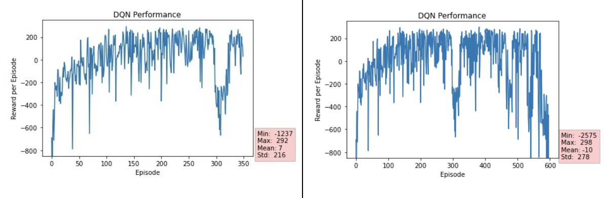
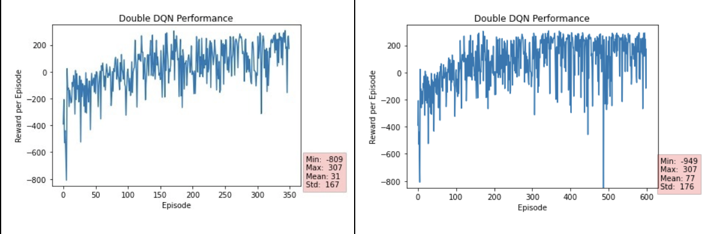
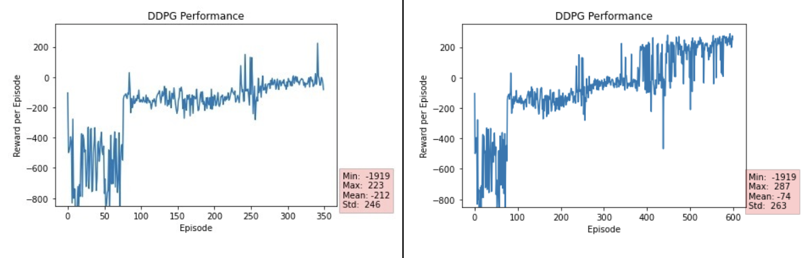
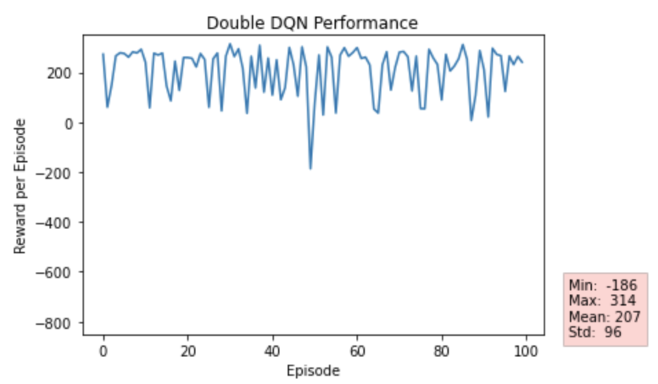
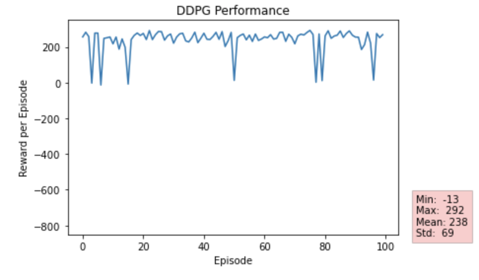

# LunarLander-with-Deep-Reinforcement-Learning
Lunar Lander environment is provided by OpenAI. The environment contains
a lander and a landing pad specified by two flags. The purpose in this environment is
to land the lander in the landing pad with no velocity. Getting farther away from the
landing pad causes a loss in the rewards that have been gained thus far. Landing on
the pad results in between 100-140 points. There is an interval in this reward as the
lander might have taken movements that move it away from the landing pad momentarily. 
If the lander crashes, it is given -100 reward points whereas having the
landing results in rest is rewarded with 100 points. Moreover, the contact of each leg
is rewarded with extra 10 points. The agent is equipped with 3 engines that work
without any concern on fuel. There are two engines on the left and right sides of the
agent and a main engine located at the bottom of it. Firing the main engine results in
-0.3 reward per frame. A successful landing is a landing that has the total reward
greater than 200.  
# Contributers
* Enes Duran  
* Muhammed Naci Dalkıran  
# Metodology
* DDPG  
* DQN  
* Double - DQN  
# DQN Results

# Double - DQN Results

# DDPG Results

# Double DQN vs DDPG Results

